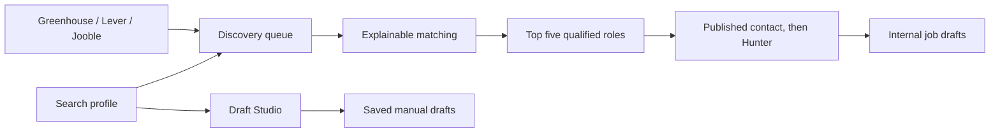

# Scoutly — local job outreach workspace

<video src="https://github.com/user-attachments/assets/c9ecbfb0-4f9e-4ff1-908c-7742be9c2685" autoplay loop muted playsinline width="800"></video>

Scoutly is a local-first React and FastAPI application for discovering roles,
ranking fit, and preparing saved recruiter-email drafts. It keeps all application
state in SQLite; sending and reply tracking are outside the application.

## Workflow



Each run returns immediately with a durable run ID. A single background worker
updates stage, progress, results, and partial failures for the React client to
poll. Runs left active by an interrupted process are marked `interrupted` when
the database reopens, and concurrent discovery is rejected.

After matching, the five highest-scoring qualified open roles receive internal
job drafts. Draft Studio is separate: it creates one-off emails that can be
explicitly saved, edited, and deleted in the Drafts section.

## Application

The responsive dark workspace includes:

- Overview metrics and live discovery progress
- Candidate preferences for titles, locations, employment type, remote policy,
  seniority, keywords, and minimum fit score
- Company Greenhouse/Lever watchlists
- Opportunity Radar with filters, fit evidence, gaps, official apply links, and
  in-page discovery progress
- Saved Draft Studio email history
- A one-off Draft Studio
- Provider connections and quota indicators

Vite proxies `/api` to FastAPI in development. FastAPI serves the production
bundle and binds to localhost by default.

## Project layout

```text
api.py                  FastAPI routes and the single-worker discovery queue
app.py                  ASGI entry point
frontend/               Vite, React, TypeScript, Tailwind, Router, Query
automation.py           Discovery, matching, contact enrichment, drafts, and CLI workflows
storage.py              SQLite schema, migrations, limits, and persistence
workflow.py             Grounded LangGraph email generation
matching.py             Hard filters and explainable role scoring
discovery.py            Greenhouse, Lever, and Jooble adapters
contacts.py             Hunter contact filtering and ranking
main.py                 Backward-compatible manual CLI
tests/                  Backend workflow, API, matching, and migration tests
```

## Setup

Requirements are Python 3.10+, Node 20+, and either a Groq API key or a local
Ollama installation. Sending mail is outside this local workspace.

```powershell
python -m venv venv
venv\Scripts\activate
pip install -r requirements-dev.txt
Copy-Item .env.example .env
cd frontend
pnpm install
```

Configure provider keys in `.env`. Without `GROQ_API_KEY`, model workflows use
the configured local Ollama model. Runtime databases and `.env` are ignored by Git.

## Development

Run the API and client in separate terminals:

```powershell
venv\Scripts\python.exe -m uvicorn app:app --host 127.0.0.1 --port 8000 --reload
cd frontend
pnpm dev
```

Open `http://127.0.0.1:5173`. CORS permits only the localhost Vite origins.

## Production

Build the client, then start FastAPI:

```powershell
cd frontend
pnpm build
cd ..
venv\Scripts\python.exe -m uvicorn app:app --host 127.0.0.1 --port 8000
```

Open `http://127.0.0.1:8000`. Deep React routes fall back to the production
`index.html`; `/api/*` remains the JSON API.

## API

The principal endpoints are:

- `GET/PUT /api/profile`, `GET/POST/PATCH /api/sources`
- `POST /api/discovery-runs`, `GET /api/discovery-runs/{id}`
- `GET /api/matches`, `GET /api/dashboard`
- `GET/POST /api/manual-drafts`, `PATCH/DELETE /api/manual-drafts/{id}`
- `POST /api/manual-draft`, `POST /api/documents/extract`
- `GET /api/settings/status`, `GET /api/health`

Interactive OpenAPI documentation is available at `/docs`.

## CLI and scheduling

The existing commands remain available:

```powershell
venv\Scripts\python.exe main.py
venv\Scripts\python.exe automation.py discover
venv\Scripts\python.exe automation.py install-scheduler
```

The scheduler discovers and prepares drafts but never sends mail.

## Verification

```powershell
venv\Scripts\python.exe -m pytest -q
cd frontend
pnpm test
pnpm typecheck
pnpm build
```

The backend tests use mocked models and providers; they do not require live
Ollama, Groq, Hunter, or Jooble access.
