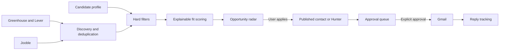
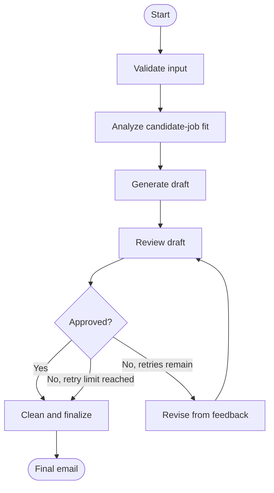

# Scoutly — Job Outreach Agent

A local-first job-search workspace built with Streamlit, LangChain, LangGraph,
SQLite, GroqCloud, Gmail, and Ollama. Scoutly discovers open roles, ranks them
against a candidate profile, finds evidence-backed recruiting contacts,
prepares outreach for approval, and tracks replies. Applying and sending always
remain human-controlled.

## What Scoutly does



Direct ATS descriptions take precedence over aggregator snippets. Hard filters
run before model scoring, and duplicate company/title/location combinations are
collapsed into one canonical role.

## Video demo

[](docs/demo/cold-email-agent-demo.mkv)

The preview plays automatically. Click it to watch or download the full-quality
demo. The recording shows the original draft studio; the current application
adds the Scoutly dashboard, opportunity radar, approval queue, and reply
tracking while retaining the demonstrated text/PDF workflow.

## How the workflow works

LangChain supplies the prompts, Ollama model integration, and structured model
outputs. LangGraph owns the typed workflow state and conditional routing.



The analysis and review stages return validated Pydantic objects instead of
free-form control text. In addition to the model review, deterministic checks
enforce the 100-150 word range and ensure the candidate's name appears exactly
once. Revision is capped at two attempts so the graph cannot loop forever.

## Features

- Local inference with Ollama and `llama3.2`
- Typed LangGraph state and conditional review routing
- Structured candidate-job analysis and review decisions
- Grounding rules that separate candidate facts from job requirements
- Bounded automatic revisions
- Branded Scoutly Streamlit workspace with overview metrics and provider status
- Paste text or upload a PDF independently for the candidate profile and job description
- Reusable Python API and backward-compatible CLI
- Mocked tests that do not require Ollama
- Broad India and remote discovery through Jooble plus curated Greenhouse/Lever boards
- Explainable, hard-filtered role matching with a fast hosted demo model
- SQLite match, outreach, and reply history
- Published contacts plus budgeted Hunter recruiter discovery with source/confidence evidence
- Editable approval queue with a hard limit of 10 sends per day
- Gmail OAuth sending and tracked-thread reply detection
- Persistent, concurrency-safe provider rate limits
- Versioned SQLite migrations that preserve existing local data

## Automated outreach safety

The scheduler discovers and evaluates roles, but it never applies or sends
mail. The user applies through the supplied listing and marks the role applied.
Only then can a verified contact and draft enter **Approval queue**. Sending
requires selecting messages and checking the explicit confirmation. The send
path rechecks the role, application state, contact evidence, duplicate history,
and daily limit.

The agent does not submit applications or answer replies. Human replies appear
in the dashboard and receive the `ColdEmailAgent/Reply` Gmail label; automated
responses are recorded separately. Contacts are enriched only for applied roles
with a score of at least 80, and Hunter results require confidence of at least
80 plus public source evidence.

## Project structure

```text
app.py                 Streamlit interface
document_input.py      PDF extraction and input-mode validation
docs/demo/             Project demonstration video
main.py                Command-line interface
workflow.py            LangChain prompts and LangGraph workflow
automation.py          Discovery, queue, mail-sync, and scheduler commands
discovery.py           Jooble/Greenhouse/Lever adapters and contact extraction
contacts.py            Hunter recruiting-contact discovery and ranking
gmail_provider.py      Gmail OAuth, sending, labels, and reply correlation
matching.py            Hard filters and structured fit scoring
storage.py             SQLite schema and persistence API
tests/test_workflow.py Mocked workflow and validation tests
tests/test_app.py      Streamlit input-mode regression tests
tests/test_document_input.py PDF extraction tests
tests/test_automation.py Discovery, quotas, sending, and reply tests
tests/test_contacts.py Hunter filtering and evidence tests
tests/test_discovery.py ATS and Jooble normalization tests
tests/test_gmail_provider.py Gmail message and reply tests
tests/test_storage_migration.py Backward-compatible database migration tests
requirements.txt       Runtime dependencies
requirements-dev.txt   Test dependencies
```

## Prerequisites

- Python 3.10 or newer
- A free GroqCloud API key, or [Ollama](https://ollama.com/) for local fallback
- For sending: Gmail and Google OAuth desktop-app credentials

```bash
ollama pull llama3.2
```

Ollama is optional when `GROQ_API_KEY` is configured.

## Installation

Create and activate a virtual environment, then install the dependencies:

```bash
python -m venv venv
```

On Windows:

```powershell
venv\Scripts\activate
pip install -r requirements.txt
```

For development and testing:

```powershell
pip install -r requirements-dev.txt
```

Copy `.env.example` to `.env` and set `GROQ_API_KEY`, or configure the hosted
demo model for the current PowerShell session:

```powershell
$env:GROQ_API_KEY="your-groq-key"
$env:GROQ_MODEL="openai/gpt-oss-20b"
$env:JOOBLE_API_KEY="your-jooble-key"
$env:HUNTER_API_KEY="your-hunter-key"
```

Candidate profiles and job descriptions are sent to Groq while this key is
present. Without it, the app uses the configured local Ollama model.

Jooble supplies broad job search and Hunter supplies recruiter-contact
enrichment. The app limits Hunter to two applied jobs per day and 40 tracked
credits per month, leaving part of the free allowance available for manual use.
All provider limits are stored atomically in SQLite, so concurrent Streamlit or
scheduler runs cannot bypass them. Safe defaults cover ATS and Jooble request
rates, 50 fit-scoring calls per day, 10 generated drafts and Gmail sends per
day, Hunter enrichment, and inbox polling. Override the corresponding values in
`.env` only when your provider plan supports a higher quota.

Default safety limits are configurable without changing code:

| Variable | Default | Purpose |
| --- | ---: | --- |
| `DAILY_SEND_LIMIT` | 10 | Maximum approved Gmail sends |
| `DAILY_ENRICHMENT_LIMIT` | 2 | Applied jobs enriched through Hunter |
| `MONTHLY_HUNTER_LIMIT` | 40 | Tracked Hunter credits |
| `DAILY_MODEL_SCORING_LIMIT` | 50 | LLM-based fit assessments |
| `DAILY_DRAFT_LIMIT` | 10 | Generated outreach drafts |
| `JOOBLE_REQUESTS_PER_MINUTE` | 10 | Short-window Jooble requests |
| `JOOBLE_REQUESTS_PER_DAY` | 100 | Daily Jooble requests |
| `ATS_REQUESTS_PER_MINUTE` | 30 | Greenhouse and Lever feed requests |
| `HUNTER_REQUESTS_PER_MINUTE` | 5 | Hunter requests |
| `INBOX_SYNCS_PER_HOUR` | 12 | Gmail reply checks |

Reservations are written atomically to SQLite, so simultaneous Streamlit and
scheduler runs cannot bypass the limits.

### Gmail setup

1. Create a Google Cloud project, enable Gmail API, and configure the OAuth
   consent screen for personal use.
2. Create **Desktop app** OAuth credentials.
3. Save the downloaded file as `.secrets/gmail-client-secret.json`.
4. Open **Settings** in the app and select **Connect/test Gmail**.

The local token is stored at `.secrets/gmail-token.json`; both credential files
are ignored by Git. The app requests `gmail.modify` because it reads tracked
threads, sends approved messages, and applies labels.

## Run the Streamlit app

```powershell
python -m streamlit run app.py
```

Open `http://localhost:8501`. The **Draft studio** still accepts independently
selected text or PDF inputs. PDFs must be unencrypted, text-based, and no larger
than 10 MB; image-only scans need OCR first.

### Automated workflow

Use the sidebar pages in order:

1. **Search profile** — save the profile, at least one desired title,
   matching filters, and any optional Greenhouse/Lever watchlist URLs.
2. **Opportunity radar** — see every enabled company, search Jooble and direct
   boards, review the top 10 matches,
   apply through the supplied link, then mark the role applied. High-fit applied
   roles are eligible for published-contact or Hunter recruiter discovery.
3. **Approval queue** — inspect contact evidence, edit drafts, select recipients,
   confirm, and send.
4. **Conversations** — inspect sent threads and detected responses.

### Five real boards for a demo

Add these from **Search profile → Company watchlist**. They are examples only;
openings change over time and the agent will filter unsuitable seniority or
locations.

| Company | Provider | Board URL |
| --- | --- | --- |
| Nirmata | Greenhouse | `https://job-boards.greenhouse.io/nirmata` |
| Headout | Greenhouse | `https://job-boards.greenhouse.io/headoutcareers` |
| Enterpret | Greenhouse | `https://job-boards.greenhouse.io/enterpret` |
| Hevo Data | Lever | `https://jobs.lever.co/hevodata` |
| Lingaro | Lever | `https://jobs.lever.co/lingarogroup` |

The watchlist, candidate profile, jobs, matches, and message history live under
`data/` and are intentionally ignored by Git. A clone starts with an empty
local database.

After Gmail is connected, install the 8 AM discovery and 15-minute reply tasks:

```powershell
python automation.py install-scheduler
```

The computer must be available for local tasks to run. Manual equivalents are:

```powershell
python automation.py discover
python automation.py sync-replies
```

### Text and PDF input behavior

The candidate profile and job description have separate selectors, so any of
these combinations work:

- Candidate text and job-description text
- Candidate PDF and job-description text
- Candidate text and job-description PDF
- Candidate PDF and job-description PDF

Selecting **Upload PDF** immediately replaces that section's text box with a
file uploader. PDF text is extracted locally before it is passed to the graph;
the original file is not sent anywhere by this application. Scanned PDFs need
OCR first because the app does not perform image recognition.

## Sample test input

**Candidate name:** `Abhinav Kumar Singh`

**Company name:** `TechNova`

**Candidate profile:**

```text
Python developer with experience building AI applications using LangChain,
LangGraph, Flask, SQL, and Ollama. Built an injury classification system using
deep learning and developed a cold-email generation agent with a multi-stage
review workflow. Comfortable developing backend APIs, integrating language
models, working with structured outputs, and writing automated tests for Python
applications.
```

**Job description:**

```text
TechNova is seeking a Python Software Engineering Intern to join its Applied AI
engineering team. The intern will work with software engineers and machine
learning practitioners to design, develop, test, and maintain applications that
use artificial intelligence in internal workflows and customer-facing products.

The selected candidate will contribute to backend services written in Python,
assist with REST API development, and help integrate large language models into
production-oriented software. Responsibilities also include creating reusable
components, reviewing technical requirements, debugging application issues,
documenting technical decisions, and writing automated tests.

Candidates should have practical Python experience through coursework,
internships, personal projects, or open-source contributions. Familiarity with
Flask, SQL databases, API development, automated testing, LangChain, LangGraph,
or locally hosted language models is beneficial. Experience building an
AI-related project or integrating an LLM into an application is an advantage.
```

The same sample can be pasted directly or saved as text-based PDFs to exercise
both input modes.

## Run the CLI

The original interactive workflow remains available:

```powershell
python main.py
```

Type `END` on a new line after the candidate profile and job description.

## Python API

```python
from workflow import ColdEmailInput, generate_cold_email

email = generate_cold_email(
    ColdEmailInput(
        candidate_name="Ada Lovelace",
        company_name="Example Company",
        candidate_profile="Python developer who built a scheduling application.",
        job_description="Software Engineer role requiring Python development.",
    )
)
```

Use `build_graph(model=..., max_revisions=...)` to inject another compatible
chat model or change the revision cap. `GROQ_MODEL` selects the hosted model and
`OLLAMA_MODEL` selects the local fallback. `openai/gpt-oss-20b` is the default
hosted demo model because it is fast and supports structured output. Provider
free tiers and model availability may change.

## Tests

```powershell
pytest
```

The tests inject deterministic LangChain runnables and cover direct approval,
revision routing, retry caps, validation, output cleaning, PDF failures,
Streamlit navigation, discovery normalization, contact provenance, persistent
rate limits, Gmail behavior, and legacy database migration.

## Troubleshooting

### Companies appear but no roles are listed

Company chips show enabled watchlist sources; job cards appear only after a
successful discovery and evaluation. Check the warning returned by **Run
discovery now**, confirm outbound network access, and verify `JOOBLE_API_KEY` if
automatic search is expected. Direct company boards do not require API keys.

### Discovery takes a long time

The first run can import hundreds of roles. Hard filters are local, but up to 50
eligible roles per day may use LLM scoring. Later runs reuse persisted matches
until a job description changes.

### Gmail cannot connect

Confirm that Gmail API is enabled, the OAuth client type is **Desktop app**, and
`.secrets/gmail-client-secret.json` exists. Delete only the local Gmail token if
you intentionally need to repeat authorization.
