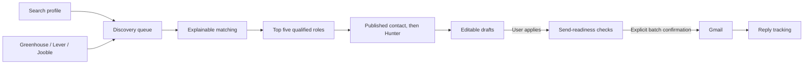

# Scoutly — local job outreach workspace

Scoutly is a local-first React and FastAPI application for discovering roles,
ranking fit, preparing recruiter outreach, and tracking Gmail replies. It keeps
applications and sending under explicit human control while preserving all
operational state in SQLite.

## Workflow



Each run returns immediately with a durable run ID. A single background worker
updates stage, progress, results, and partial failures for the React client to
poll. Runs left active by an interrupted process are marked `interrupted` when
the database reopens, and concurrent discovery is rejected.

After matching, the five highest-scoring qualified open roles receive drafts.
A draft does not claim the candidate applied unless `applied_at` exists. Contact
discovery checks contacts published with the job first and then uses Hunter
within the configured two-per-day, five-per-minute, and forty-per-month limits.
Drafts are created even when no contact can be found.

Sending remains blocked until all of these are true:

- The role is open.
- The candidate marked the application complete.
- A selected contact and public source evidence exist.
- Subject and body are non-empty.
- No previous send exists for the role.
- The daily Gmail quota has capacity.
- The user confirms the batch in the final dialog.

The UI and API use the same structured blocker codes. Delivery creates an
immutable `outreach` snapshot; editable work stays in the separate `drafts`
table. Existing queued outreach is migrated into edited drafts without losing
Gmail messages or thread history. If a contact appears later, an untouched
generic draft is personalized automatically. Edited drafts are preserved,
marked stale, and expose **Personalize with contact**.

## Application

The responsive dark workspace includes:

- Overview metrics and live discovery progress
- Candidate preferences and company ATS watchlists
- Opportunity Radar with filters, fit evidence, gaps, and official apply links
- Approval cards with editing, contact provenance, application state, and send checks
- Conversation and reply tracking
- A one-off Draft Studio
- Provider connections and quota indicators

Vite proxies `/api` to FastAPI in development. FastAPI serves the production
bundle and binds to localhost by default.

## Project layout

```text
api.py                  FastAPI routes and the single-worker discovery queue
app.py                  ASGI entry point
frontend/               Vite, React, TypeScript, Tailwind, Router, Query
automation.py           Discovery, draft, contact, send, sync, and CLI workflows
storage.py              SQLite schema, migration, limits, and persistence
workflow.py             Grounded LangGraph email generation
matching.py             Hard filters and explainable role scoring
discovery.py            Greenhouse, Lever, and Jooble adapters
contacts.py             Hunter contact filtering and ranking
gmail_provider.py       Desktop OAuth, sending, labels, and reply correlation
main.py                 Backward-compatible manual CLI
tests/                  Backend workflow, API, provider, and migration tests
```

## Setup

Requirements are Python 3.10+, Node 20+, and either a Groq API key or a local
Ollama installation. Gmail OAuth desktop credentials are needed only to send or
sync mail.

```powershell
python -m venv venv
venv\Scripts\activate
pip install -r requirements-dev.txt
Copy-Item .env.example .env
cd frontend
pnpm install
```

Configure provider keys in `.env`. Without `GROQ_API_KEY`, model workflows use
the configured local Ollama model. Runtime databases, `.env`, Gmail credentials,
and OAuth tokens are ignored by Git.

### Gmail credentials

For Gmail, create desktop OAuth credentials in a Google Cloud project with the
Gmail API enabled. Download the JSON file, rename it to
`gmail-client-secret.json`, and place it at:

```text
C:\Users\abhin\Desktop\Projects\cold-email-agent\.secrets\gmail-client-secret.json
```

If the downloaded file is still in Downloads, move it from PowerShell:

```powershell
Move-Item `
  -LiteralPath "C:\Users\abhin\Downloads\client_secret_XXXX.json" `
  -Destination "C:\Users\abhin\Desktop\Projects\cold-email-agent\.secrets\gmail-client-secret.json"
```

Replace `client_secret_XXXX.json` with the actual downloaded filename. The app
writes the local token to `.secrets/gmail-token.json` and requests
`gmail.modify` for sending, tracked thread reads, and labels. `.secrets/` is
ignored by Git, so OAuth credentials and tokens stay local.

## Development

Run the API and client in separate terminals:

```powershell
venv\Scripts\python.exe -m uvicorn app:app --host 127.0.0.1 --port 8000 --reload
cd frontend
pnpm dev
```

Open `http://127.0.0.1:5173`. CORS permits only the localhost Vite origins.

## Production

Build the client, then start FastAPI:

```powershell
cd frontend
pnpm build
cd ..
venv\Scripts\python.exe -m uvicorn app:app --host 127.0.0.1 --port 8000
```

Open `http://127.0.0.1:8000`. Deep React routes fall back to the production
`index.html`; `/api/*` remains the JSON API.

## API

The principal endpoints are:

- `GET/PUT /api/profile`, `GET/POST/PATCH /api/sources`
- `POST /api/discovery-runs`, `GET /api/discovery-runs/{id}`
- `GET /api/matches`, `GET /api/approval-items`
- `PATCH /api/drafts/{id}`, `POST /api/drafts/{id}/regenerate`
- `POST /api/jobs/{id}/mark-applied`, `POST /api/jobs/{id}/find-contact`
- `POST /api/outreach/send`
- `GET /api/dashboard`, `GET /api/conversations`, `POST /api/replies/sync`
- `POST /api/gmail/connect`, `GET /api/settings/status`

Interactive OpenAPI documentation is available at `/docs`.

## CLI and scheduling

The existing commands remain available:

```powershell
venv\Scripts\python.exe main.py
venv\Scripts\python.exe automation.py discover
venv\Scripts\python.exe automation.py sync-replies
venv\Scripts\python.exe automation.py install-scheduler
```

The scheduler discovers and prepares drafts but never applies or sends.

## Verification

```powershell
venv\Scripts\python.exe -m pytest -q
cd frontend
pnpm test
pnpm typecheck
pnpm build
```

The backend tests use mocked models and providers; they do not require live
Ollama, Groq, Hunter, Jooble, or Gmail access.
