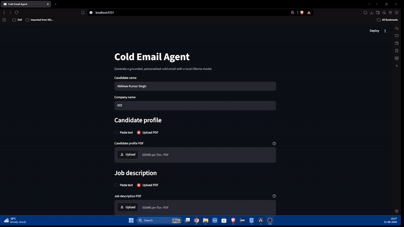

# Cold Email Agent

A local cold-email generator built with LangChain, LangGraph, Streamlit, and
Ollama. It compares a candidate profile with a job description, drafts a
personalized email, and runs a bounded grounding-review loop before returning
the final result.

## Video demo

[](docs/demo/cold-email-agent-demo.mkv)

The preview plays automatically. Click it to watch or download the full-quality
demo, which shows the Streamlit interface, text/PDF inputs, and generation
workflow.

## How the workflow works

LangChain supplies the prompts, Ollama model integration, and structured model
outputs. LangGraph owns the typed workflow state and conditional routing.


The analysis and review stages return validated Pydantic objects instead of
free-form control text. In addition to the model review, deterministic checks
enforce the 100-150 word range and ensure the candidate's name appears exactly
once. Revision is capped at two attempts so the graph cannot loop forever.

## Features

- Local inference with Ollama and `llama3.2`
- Typed LangGraph state and conditional review routing
- Structured candidate-job analysis and review decisions
- Grounding rules that separate candidate facts from job requirements
- Bounded automatic revisions
- Streamlit browser interface
- Paste text or upload a PDF independently for the candidate profile and job description
- Reusable Python API and backward-compatible CLI
- Mocked tests that do not require Ollama

## Project structure

```text
app.py                 Streamlit interface
document_input.py      PDF extraction and input-mode validation
docs/demo/             Project demonstration video
main.py                Command-line interface
workflow.py            LangChain prompts and LangGraph workflow
tests/test_workflow.py Mocked workflow and validation tests
tests/test_app.py      Streamlit input-mode regression tests
tests/test_document_input.py PDF extraction tests
requirements.txt       Runtime dependencies
requirements-dev.txt   Test dependencies
```

## Prerequisites

- Python 3.10 or newer
- [Ollama](https://ollama.com/) installed and running
- The Llama 3.2 model downloaded locally

```bash
ollama pull llama3.2
```

## Installation

Create and activate a virtual environment, then install the dependencies:

```bash
python -m venv venv
```

On Windows:

```powershell
venv\Scripts\activate
pip install -r requirements.txt
```

For development and testing:

```powershell
pip install -r requirements-dev.txt
```

## Run the Streamlit app

```powershell
streamlit run app.py
```

Enter the candidate name and company name, then choose **Paste text** or
**Upload PDF** independently for the candidate profile and job description.
Uploaded files must be unencrypted, text-based PDFs no larger than 10 MB;
image-only scans should be pasted as text after OCR. The UI shows only the
finalized email, while analysis and review details remain internal.

### Text and PDF input behavior

The candidate profile and job description have separate selectors, so any of
these combinations work:

- Candidate text and job-description text
- Candidate PDF and job-description text
- Candidate text and job-description PDF
- Candidate PDF and job-description PDF

Selecting **Upload PDF** immediately replaces that section's text box with a
file uploader. PDF text is extracted locally before it is passed to the graph;
the original file is not sent anywhere by this application. Scanned PDFs need
OCR first because the app does not perform image recognition.

## Sample test input

**Candidate name:** `Abhinav Kumar Singh`

**Company name:** `TechNova`

**Candidate profile:**

```text
Python developer with experience building AI applications using LangChain,
LangGraph, Flask, SQL, and Ollama. Built an injury classification system using
deep learning and developed a cold-email generation agent with a multi-stage
review workflow. Comfortable developing backend APIs, integrating language
models, working with structured outputs, and writing automated tests for Python
applications.
```

**Job description:**

```text
TechNova is seeking a Python Software Engineering Intern to join its Applied AI
engineering team. The intern will work with software engineers and machine
learning practitioners to design, develop, test, and maintain applications that
use artificial intelligence in internal workflows and customer-facing products.

The selected candidate will contribute to backend services written in Python,
assist with REST API development, and help integrate large language models into
production-oriented software. Responsibilities also include creating reusable
components, reviewing technical requirements, debugging application issues,
documenting technical decisions, and writing automated tests.

Candidates should have practical Python experience through coursework,
internships, personal projects, or open-source contributions. Familiarity with
Flask, SQL databases, API development, automated testing, LangChain, LangGraph,
or locally hosted language models is beneficial. Experience building an
AI-related project or integrating an LLM into an application is an advantage.
```

The same sample can be pasted directly or saved as text-based PDFs to exercise
both input modes.

## Run the CLI

The original interactive workflow remains available:

```powershell
python main.py
```

Type `END` on a new line after the candidate profile and job description.

## Python API

```python
from workflow import ColdEmailInput, generate_cold_email

email = generate_cold_email(
    ColdEmailInput(
        candidate_name="Ada Lovelace",
        company_name="Example Company",
        candidate_profile="Python developer who built a scheduling application.",
        job_description="Software Engineer role requiring Python development.",
    )
)
```

Use `build_graph(model=..., max_revisions=...)` to inject another compatible
chat model or change the revision cap. Set `OLLAMA_MODEL` to select a different
locally installed Ollama model without changing the code.

## Tests

```powershell
pytest
```

The tests inject deterministic LangChain runnables and cover direct approval,
revision routing, the retry cap, deterministic validation, output cleaning, PDF
extraction failures, and immediate Streamlit uploader rendering.
